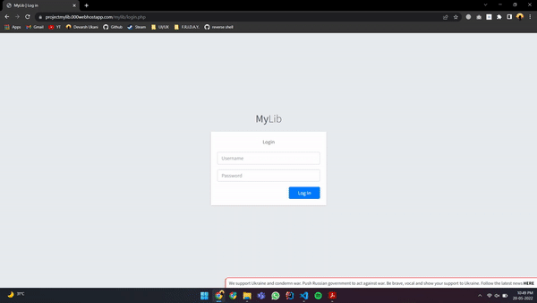
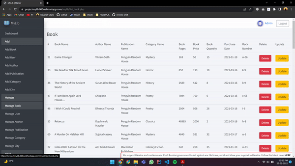

# MyLib - Library Management System

This repository is Admin Panel of MyLib Project. 
You can Find User-end [Android Application](https://github.com/devarshukani/MyLib-Android) Code Here

MyLib is Library Management System with Android Application to User side and Admin Panel Website for Library Management team.

## Live Preview
Click [here](https://projectmylib.000webhostapp.com/mylib/login.php) to Experience Admin Panel Live 

## Features
- Login
- Dashboard
- Add, Delete & Update Books
- Add, Delete & Update User
- Add, Delete & Update Author
- Add, Delete & Update Publication
- Add, Delete & Update Category
- Add, Delete & Update City
- Issue, Return & Renew Books

## Tools and Language Used
- Sublime Text, XAMPP
- PHP, MySQL, JSON

## Admin Panel Preview

## Contributing
Pull requests are welcome.  
For major changes, please open an issue first to discuss what you would like to change.
